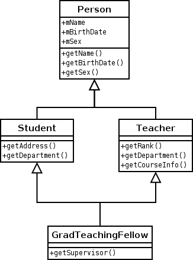

# 20 Feb 2021

## Complexity Analysis

- Time: number of elements
- Space: amount of memory

## Inheritance & Interface

- Java doesn't allow multiple inheritance when using extend
	- i.e. when two parent classes have the same method
- We can override it using interface and @Override

## Enum

???

## Inner Classes

## Collections